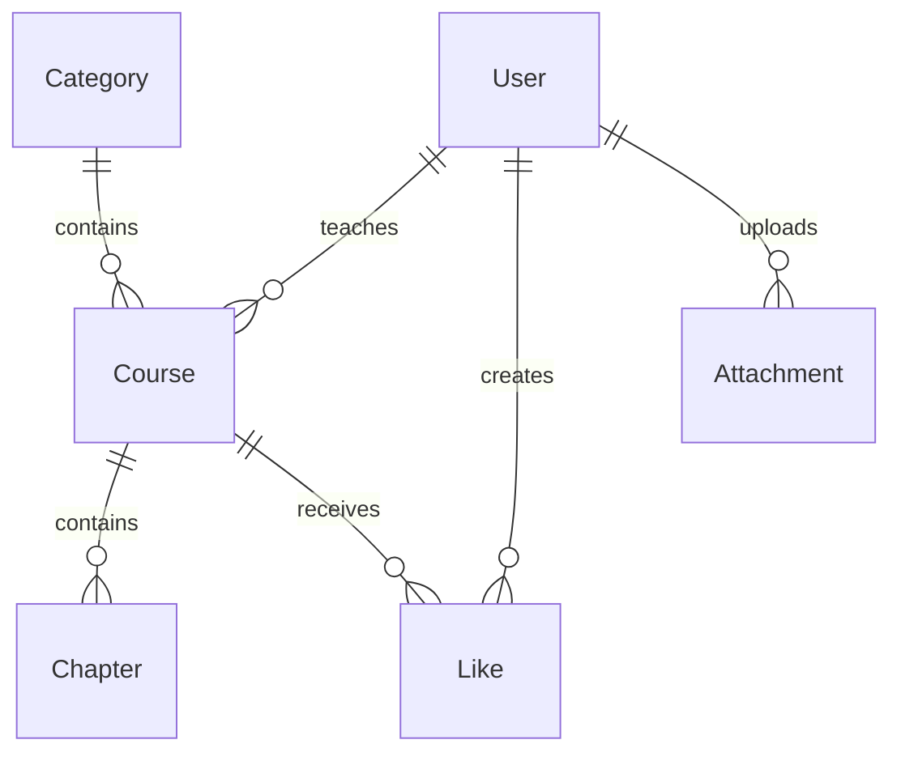

# CLWY API

CLWY API 是一个基于 Express、Sequelize、MySQL 和 Redis 的在线教育平台后端，提供公开课程内容、用户中心、点赞、图片上传以及后台管理接口。

## 主要能力

- 课程、分类、章节和文章查询
- 用户注册、登录、资料及账户管理
- 用户点赞与点赞课程列表
- 管理员用户、课程、章节、分类、文章和系统设置管理
- 文章软删除、恢复与彻底删除
- 腾讯云 COS 图片上传与附件管理
- 用户统计图表
- Redis 查询缓存与写入后缓存失效
- SVG 图形验证码与登录/注册验证码校验
- JWT 身份认证、登录限流、请求校验和统一响应

## 技术栈

| 类型     | 技术                             |
| -------- | -------------------------------- |
| 运行时   | Node.js 18+                      |
| Web 框架 | Express 5                        |
| ORM      | Sequelize 6                      |
| 数据库   | MySQL 8                          |
| 缓存     | Redis                            |
| 身份认证 | JWT + bcryptjs                   |
| 图形验证码 | svg-captcha                    |
| 文件上传 | Multer + 腾讯云 COS              |
| 安全     | Helmet、CORS、express-rate-limit |
| 日志     | Morgan                           |
| 测试     | Node.js Test Runner              |
| 代码质量 | ESLint + Prettier                |

## 项目结构

```text
clwy-api/
├── app.js                         # Express 应用、中间件和路由挂载
├── bin/www                        # HTTP 服务启动入口
├── config/
│   ├── config.js                  # Sequelize 多环境配置组装
│   ├── config.json                # Sequelize CLI 默认配置（保留文件）
│   └── env.js                     # 唯一 dotenv 入口与环境变量访问
├── middlewares/
│   ├── auth.js                    # 前后台共用 JWT 认证
│   ├── image-upload.js            # Multer 图片解析与限制
│   └── validate-captcha.js        # 图形验证码校验
├── migrations/                    # 数据表、索引、软删除列和外键迁移
├── models/
│   ├── index.js                   # Sequelize 初始化与模型加载
│   ├── article.js                 # 文章模型（支持 paranoid 软删除）
│   ├── attachment.js              # 上传附件模型
│   ├── category.js                # 课程分类模型
│   ├── chapter.js                 # 课程章节模型
│   ├── course.js                  # 课程模型与计数器字段
│   ├── like.js                    # 用户点赞关系模型
│   ├── setting.js                 # 单例系统设置模型
│   └── user.js                    # 用户、密码加密与角色模型
├── routes/
│   ├── admin/                     # 管理员接口
│   ├── articles.js                # 前台文章接口
│   ├── auth.js                    # 前台注册与登录
│   ├── captcha.js                 # SVG 图形验证码生成
│   ├── categories.js              # 前台分类接口
│   ├── chapters.js                # 前台章节接口
│   ├── courses.js                 # 前台课程接口
│   ├── index.js                   # 首页聚合接口
│   ├── likes.js                   # 点赞接口
│   ├── search.js                  # 课程搜索
│   ├── settings.js                # 站点设置查询
│   ├── uploads.js                 # COS 图片上传
│   └── users.js                   # 用户中心
├── seeders/                       # 开发种子数据
├── test/                          # Node.js 内置测试
├── utils/
│   ├── cache.js                   # 缓存键、cache-aside 与业务失效规则
│   ├── cos.js                     # COS 上传、删除与文件命名
│   ├── date-time.js               # Moment 创建/更新时间响应格式化
│   ├── pagination.js              # 安全分页参数解析
│   ├── redis.js                   # Redis 底层连接和原子读写
│   ├── responses.js               # 统一成功和失败响应
│   └── routes.js                  # 异步路由、字段白名单、资源查询和分页
├── docker-compose.yml             # 本地 MySQL 与 Redis
├── .env.example                   # 环境变量示例
└── package.json
```

## 复用模块设计

重构后的路由只保留领域逻辑，通用机制集中在少量高复用模块中：

| 模块                          | 统一处理的逻辑                                                          |
| ----------------------------- | ----------------------------------------------------------------------- |
| `config/env.js`               | 唯一加载 `.env`，集中提供端口、JWT、数据库、Redis 和 COS 配置           |
| `middlewares/auth.js`         | Bearer Token 提取、HS256 验签、前台用户 ID 注入、管理员存在性与角色检查 |
| `middlewares/image-upload.js` | Multer 内存存储、MIME 白名单、单文件与 10 MB 限制、Promise 化解析       |
| `middlewares/validate-captcha.js` | 验证码键与文本提取、Redis 读取比对、失效后立即删除防重放           |
| `utils/routes.js`             | 异步异常响应、请求字段白名单、资源 404、Sequelize 标准分页              |
| `utils/cache.js`              | 缓存键命名、cache-aside、精确键/模式失效、课程相关缓存联动清理          |
| `utils/redis.js`              | Redis 单例连接、JSON 序列化、原子 `SET EX`、批量删除                    |
| `utils/cos.js`                | COS 配置检查、唯一文件名、上传、删除与错误转换                          |
| `utils/date-time.js`          | 递归格式化列表、详情和关联数据中的 `createdAt`、`updatedAt`             |
| `utils/responses.js`          | 成功响应以及 Sequelize、JWT、Multer、HTTP 错误映射                      |

每个异步路由通过 `asyncRoute` 进入统一错误处理；写接口通过 `pickFields` 明确允许字段；分页列表通过 `paginate` 返回一致结构。这样错误状态、分页规则和字段过滤只需在一个位置维护。

## 快速开始

### 环境要求

- Node.js 18 或更高版本
- npm
- MySQL 8
- Redis 7（兼容版本也可）

项目当前通过 `npx sequelize-cli` 执行数据库命令，首次运行时 `npx` 可能需要下载 Sequelize CLI。

### 1. 安装依赖

```bash
npm install
```

### 2. 启动本地基础服务

可以使用项目提供的 Docker Compose 启动 MySQL 和 Redis：

```bash
docker compose up -d mysql redis
```

`docker-compose.yml` 面向本地开发，会把 `3306` 和 `6379` 映射到宿主机。不要原样用于公网生产环境。

### 3. 配置环境变量

```bash
cp .env.example .env
```

至少需要配置数据库连接、Redis 地址和 JWT 密钥。可以使用下面的命令生成 JWT 密钥：

```bash
node -e "console.log(require('crypto').randomBytes(32).toString('hex'))"
```

### 4. 初始化数据库

```bash
# 创建数据库
npx sequelize-cli db:create

# 执行全部迁移
npx sequelize-cli db:migrate

# 可选：写入开发种子数据
npx sequelize-cli db:seed:all
```

最新迁移会为课程、章节、点赞和附件关系添加数据库外键。已有数据库在迁移前应先确认不存在孤儿数据。

### 5. 启动服务

```bash
npm start
```

默认地址：`http://localhost:3000`。`GET /` 是首页业务接口，不是独立健康检查接口，它依赖 MySQL 和 Redis 可用。

## 环境变量

| 变量                    | 必填     | 默认值                   | 说明                                  |
| ----------------------- | -------- | ------------------------ | ------------------------------------- |
| `PORT`                  | 否       | `3000`                   | HTTP 服务端口                         |
| `NODE_ENV`              | 否       | `development`            | `development`、`test` 或 `production` |
| `SECRET_KEY`            | 是       | 无                       | JWT 签名密钥                          |
| `JWT_EXPIRES_IN`        | 否       | 前台 `7d`，后台 `1h`     | 设置后前后台 Token 共用该有效期       |
| `CORS_ORIGINS`          | 否       | `http://localhost:5173,http://localhost:3000` | 允许跨域访问的前端来源，逗号分隔 |
| `DB_USERNAME`           | 否       | `root`                   | MySQL 用户名                          |
| `DB_PASSWORD`           | 生产必填 | `null`                   | MySQL 密码                            |
| `DB_DATABASE`           | 否       | 按环境选择               | 数据库名                              |
| `DB_HOST`               | 否       | `127.0.0.1`              | MySQL 主机                            |
| `REDIS_URL`             | 否       | `redis://localhost:6379` | Redis 连接地址                        |
| `COS_ACCESS_KEY_ID`     | 上传必填 | 无                       | 腾讯云 COS SecretId                   |
| `COS_ACCESS_KEY_SECRET` | 上传必填 | 无                       | 腾讯云 COS SecretKey                  |
| `COS_BUCKET`            | 上传必填 | 无                       | COS Bucket 名称                       |
| `COS_REGION`            | 上传必填 | 无                       | COS 地域，例如 `ap-shanghai`          |

环境变量由 `config/env.js` 统一加载：

- 每个 Node.js 进程只执行一次 `dotenv.config()`。
- `.env` 使用相对项目目录计算的绝对路径，不依赖启动命令所在目录。
- Shell、Docker、PM2 等已经注入的进程变量优先于 `.env`。
- Express、Sequelize CLI、JWT、Redis 和 COS 共用同一配置入口。
- 配置通过 getter 读取，测试可以安全地临时覆盖 `process.env`。

## 身份认证

需要认证的接口使用 Bearer Token：

```http
Authorization: Bearer <token>
```

- 前台 Token：通过 `POST /auth/sign_in` 获取（需要图形验证码）。
- 管理员 Token：通过 `POST /admin/auth/sign_in` 获取（需要图形验证码），用户角色必须为 `100`。
- 前台注册 `POST /auth/sign_up` 同样需要图形验证码。
- 验证码通过 `GET /captcha` 获取，返回 captchaKey 和 SVG 图片数据，有效期 10 分钟。
- 用户模型默认查询不包含密码；登录和密码验证必须显式使用 `withPassword` scope。
- 所有用户响应通过安全序列化移除密码哈希。
- 前台 `/auth` 路由整体限制为每个 IP 15 分钟最多 20 次请求。
- 管理员登录限制为每个 IP 15 分钟最多 10 次请求。

## API 路由

### 公开接口

| 方法 | 路径                   | 说明                                   |
| ---- | ---------------------- | -------------------------------------- |
| GET  | `/`                    | 首页推荐、人气和入门课程               |
| GET  | `/captcha`             | 获取图形验证码（SVG）                  |
| GET  | `/categories`          | 分类列表                               |
| GET  | `/courses?categoryId=` | 指定分类下的课程列表                   |
| GET  | `/courses/:id`         | 课程、分类、讲师和章节详情             |
| GET  | `/chapters/:id`        | 章节、课程、讲师和同课程章节           |
| GET  | `/articles`            | 文章列表                               |
| GET  | `/articles/:id`        | 文章详情                               |
| GET  | `/settings`            | 站点设置                               |
| GET  | `/search?name=`        | 按名称搜索课程；不传名称时返回全部课程 |
| POST | `/auth/sign_up`        | 用户注册（需验证码）                   |
| POST | `/auth/sign_in`        | 用户登录（需验证码）                   |

### 前台认证接口

| 方法 | 路径             | 说明                                 |
| ---- | ---------------- | ------------------------------------ |
| GET  | `/users/me`      | 当前用户资料                         |
| PUT  | `/users/info`    | 更新头像、昵称、性别、公司和简介     |
| PUT  | `/users/account` | 验证当前密码后更新邮箱、用户名或密码 |
| POST | `/likes`         | 切换课程点赞状态                     |
| GET  | `/likes`         | 当前用户点赞的课程列表               |
| POST | `/uploads/oss`   | 上传一张 JPG/PNG 图片到 COS          |

点赞切换会在事务中锁定课程行，确保 Like 记录与 `likesCount` 在并发请求下保持一致。

### 管理员认证

| 方法 | 路径                  | 说明       |
| ---- | --------------------- | ---------- |
| POST | `/admin/auth/sign_in` | 管理员登录（需验证码） |

### 管理员文章接口

| 方法 | 路径                           | 说明                                   |
| ---- | ------------------------------ | -------------------------------------- |
| GET  | `/admin/articles`              | 文章列表；支持 `title`、`deleted` 筛选 |
| GET  | `/admin/articles/:id`          | 未删除文章详情                         |
| POST | `/admin/articles`              | 创建文章                               |
| PUT  | `/admin/articles/:id`          | 更新文章                               |
| POST | `/admin/articles/delete`       | 按请求体 `id` 软删除文章               |
| POST | `/admin/articles/restore`      | 按请求体 `id` 恢复文章                 |
| POST | `/admin/articles/force_delete` | 按请求体 `id` 彻底删除文章             |

### 管理员分类接口

| 方法   | 路径                    | 说明                       |
| ------ | ----------------------- | -------------------------- |
| GET    | `/admin/categories`     | 分类列表；支持 `name` 筛选 |
| GET    | `/admin/categories/:id` | 分类详情                   |
| POST   | `/admin/categories`     | 创建分类                   |
| PUT    | `/admin/categories/:id` | 更新分类                   |
| DELETE | `/admin/categories/:id` | 删除没有课程的分类         |

### 管理员课程接口

| 方法   | 路径                 | 说明                 |
| ------ | -------------------- | -------------------- |
| GET    | `/admin/courses`     | 课程列表和多条件筛选 |
| GET    | `/admin/courses/:id` | 课程详情             |
| POST   | `/admin/courses`     | 创建课程             |
| PUT    | `/admin/courses/:id` | 更新课程             |
| DELETE | `/admin/courses/:id` | 删除没有章节的课程   |

课程列表支持 `categoryId`、`userId`、`name`、`recommended` 和 `introductory` 参数。

### 管理员章节接口

| 方法   | 路径                        | 说明                                         |
| ------ | --------------------------- | -------------------------------------------- |
| GET    | `/admin/chapters?courseId=` | 章节列表；`courseId` 必填，支持 `title` 筛选 |
| GET    | `/admin/chapters/:id`       | 章节详情                                     |
| POST   | `/admin/chapters`           | 创建章节并增加课程章节数                     |
| PUT    | `/admin/chapters/:id`       | 更新章节；跨课程移动时同步两侧章节数         |
| DELETE | `/admin/chapters/:id`       | 删除章节并减少课程章节数                     |

### 管理员用户接口

| 方法   | 路径               | 说明                                       |
| ------ | ------------------ | ------------------------------------------ |
| GET    | `/admin/users`     | 用户列表；支持邮箱、用户名、昵称和角色筛选 |
| GET    | `/admin/users/me`  | 当前管理员资料                             |
| GET    | `/admin/users/:id` | 用户详情                                   |
| POST   | `/admin/users`     | 创建用户                                   |
| PUT    | `/admin/users/:id` | 更新用户                                   |
| DELETE | `/admin/users/:id` | 删除用户；禁止自删和删除最后一位管理员     |

### 管理员设置、统计和附件接口

| 方法   | 路径                        | 说明                             |
| ------ | --------------------------- | -------------------------------- |
| GET    | `/admin/settings`           | 系统设置                         |
| PUT    | `/admin/settings`           | 更新系统设置                     |
| GET    | `/admin/settings/flush-all` | 清空当前 Redis 实例全部缓存      |
| GET    | `/admin/charts/gender`      | 用户性别分布                     |
| GET    | `/admin/charts/user`        | 每月注册用户数                   |
| POST   | `/admin/uploads/oss`        | 以管理员身份上传图片             |
| GET    | `/admin/attachments`        | 附件列表；支持原文件名筛选       |
| POST   | `/admin/attachments`        | 占位接口，实际创建请使用上传接口 |
| DELETE | `/admin/attachments/:id`    | 删除 COS 文件和附件记录          |

## 分页参数

支持分页的接口统一接受以下查询参数：

| 参数                    | 默认值 | 限制                          | 说明     |
| ----------------------- | ------ | ----------------------------- | -------- |
| `currentPage` 或 `page` | `1`    | 正安全整数                    | 当前页   |
| `pageSize`              | `10`   | 正安全整数，最大按 `100` 执行 | 每页数量 |

负数、小数、非数字、`Infinity` 以及导致 offset 溢出的值会返回 `400`。

分页响应示例：

```json
{
  "status": 200,
  "message": "查询成功。",
  "data": {
    "courses": [],
    "pagination": {
      "total": 0,
      "currentPage": 1,
      "pageSize": 10
    }
  }
}
```

## 图片上传

上传接口接收 `multipart/form-data`，文件字段名为 `file`：

```bash
curl -X POST http://localhost:3000/uploads/oss \
  -H "Authorization: Bearer <token>" \
  -F "file=@avatar.png"
```

限制：

- MIME 类型仅允许 `image/jpeg` 和 `image/png`
- 每次只能上传一个文件
- 文件大小上限为 10 MB
- 文件成功写入 COS 后会在 `Attachments` 表保存记录
- 如果附件记录写入失败，会尝试删除刚上传的 COS 对象，避免孤儿文件

## 统一响应

成功响应：

```json
{
  "status": 200,
  "message": "操作成功。",
  "data": {}
}
```

所有成功响应中的 `createdAt` 和 `updatedAt`（包括数组和嵌套关联）统一使用 `YYYY-MM-DD HH:mm:ss` 格式。数据库字段本身仍保持 DATE 类型，`deletedAt` 不受影响。

失败响应：

```json
{
  "status": 400,
  "message": "请求参数错误。",
  "errors": ["参数说明"]
}
```

| 状态码 | 场景                             |
| ------ | -------------------------------- |
| `400`  | 参数或模型校验失败               |
| `401`  | Token 缺失、无效、过期或权限不足 |
| `403`  | 已认证但操作被禁止               |
| `404`  | 资源不存在                       |
| `409`  | 唯一键、外键或业务状态冲突       |
| `429`  | 触发限流                         |
| `500`  | 未识别的服务器错误               |
| `502`  | COS 等上游服务操作失败           |

## 数据模型



主要完整性规则：

- `Users.email` 和 `Users.username` 唯一。
- `Categories.name` 唯一。
- `Likes(courseId, userId)` 使用复合唯一索引。
- 删除用户或课程时，其点赞记录由数据库级联删除。
- 分类、课程、章节和附件的其他父子关系使用限制删除。
- `Article` 使用 `deletedAt` 实现软删除。
- `Setting` 在应用层保持单例。

### 枚举值

| 字段          | 值    | 含义     |
| ------------- | ----- | -------- |
| `User.role`   | `0`   | 普通用户 |
| `User.role`   | `100` | 管理员   |
| `User.gender` | `0`   | 未选择   |
| `User.gender` | `1`   | 男性     |
| `User.gender` | `2`   | 女性     |

## 缓存策略

Redis 用于缓存首页、分类、课程、章节、文章、设置、用户查询结果和图形验证码。

- 首页缓存默认有效期为 30 分钟。
- 其他缓存主要通过后台写操作主动失效。
- 公共讲师资料与当前用户私有资料使用不同缓存命名空间。
- 完整课程详情与章节页课程摘要使用不同缓存键，避免不同数据形状互相覆盖。
- 课程写操作会清理课程列表、课程详情和首页缓存。
- 章节写操作会清理章节、课程列表、课程详情和首页缓存。
- 点赞操作会清理课程列表、课程详情和首页缓存。
- 管理员可通过 `GET /admin/settings/flush-all` 清空当前 Redis 实例；如果 Redis 与其他系统共用，请谨慎使用。

## 种子数据

当前种子文件包含：

| 数据     | 数量 |
| -------- | ---: |
| 用户     |    6 |
| 分类     |    6 |
| 课程     |   14 |
| 章节     |   67 |
| 文章     |   15 |
| 点赞关系 |   32 |
| 系统设置 |    1 |

种子数据依赖自增 ID 从空数据库开始分配，建议仅用于全新开发数据库。

## 测试与代码质量

```bash
# 运行测试
npm test

# ESLint 检查
npm run lint

# 自动修复可修复的 ESLint 问题
npm run lint:fix

# 检查格式
npm run format:check

# 格式化项目
npm run format
```

当前共有 17 个测试，覆盖：

- 分页默认值、上限、非法参数和 offset 溢出
- 请求字段白名单
- 资源查询与统一 404
- 标准分页数据结构
- 异步路由错误响应
- Bearer Token 提取和 HS256 验签
- 环境变量 getter 和运行时覆盖
- Moment `createdAt`、`updatedAt` 递归格式化与异常值处理
- 不同数据形状的缓存键隔离
- 密码参数错误和用户安全序列化
- Sequelize 显式关联外键

## 部署注意事项

- 必须替换 `.env.example` 中的示例密钥和密码。
- 不要把 `.env`、COS 密钥或数据库数据目录提交到版本库。
- 生产环境应使用受限数据库账号，不要使用 MySQL root 用户。
- 生产 Redis 应启用访问控制并限制网络访问。
- `docker-compose.yml` 仅用于本地开发。
- 部署前需通过 `CORS_ORIGINS` 配置生产 CORS 来源，多个来源使用英文逗号分隔。
- 建议在反向代理或负载均衡层配置 TLS、请求体限制和可信代理设置。
