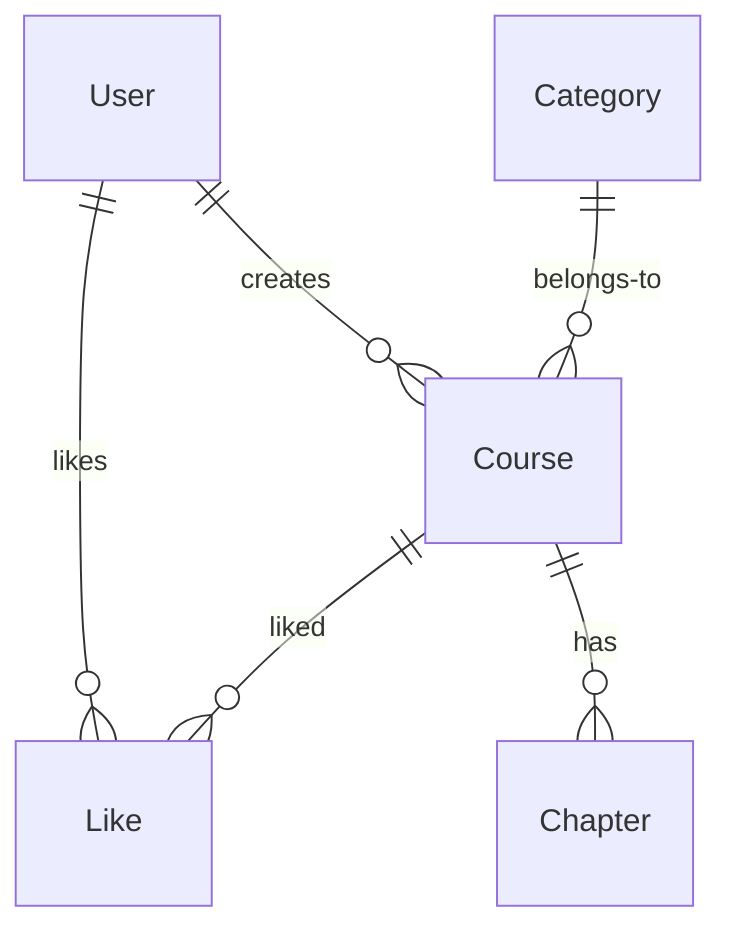

# CLWY API

基于 Express + Sequelize + MySQL 的在线教育后台管理系统 API。

## 技术栈

| 层 | 技术 |
|---|------|
| 运行时 | Node.js 18+ |
| 框架 | Express 4 |
| 数据库 | MySQL 8 |
| ORM | Sequelize 6 |
| 认证 | JWT (jsonwebtoken) + bcryptjs |
| 限流 | express-rate-limit |
| 日志 | morgan |
| 校验 | Sequelize Model Validation |
| Lint | ESLint + Prettier |

## 目录结构

```
clwy-api/
├── app.js                 # Express 入口，路由挂载
├── bin/www                # HTTP 服务器启动入口
├── config/
│   └── config.json        # Sequelize 数据库配置（多环境）
├── middlewares/
│   └── admin-auth.js      # Bearer Token 鉴权中间件
├── models/                # Sequelize 模型
│   ├── index.js           # 模型加载器
│   ├── article.js         # 文章模型
│   ├── category.js        # 分类模型
│   ├── chapter.js         # 章节模型
│   ├── course.js          # 课程模型
│   ├── like.js            # 点赞模型
│   ├── setting.js         # 系统设置模型（单例）
│   └── user.js            # 用户模型（bcrypt 密码加密）
├── routes/
│   ├── index.js           # 公开路由（健康检查）
│   ├── users.js           # 用户路由（占位）
│   └── admin/             # 后台管理路由
│       ├── auth.js        # 管理员登录（限速 + JWT 签发）
│       ├── articles.js    # 文章 CRUD
│       ├── categories.js  # 分类 CRUD（含删除保护）
│       ├── chapters.js    # 章节 CRUD（含课程关联）
│       ├── charts.js      # 统计图表（性别/用户增长）
│       ├── courses.js     # 课程 CRUD（多条件筛选 + 删除保护）
│       ├── settings.js    # 系统设置 CRUD（单例）
│       └── users.js       # 管理员端用户 CRUD
├── utils/
│   ├── errors.js          # BadRequestError / UnauthorizedError / NotFoundError
│   └── responses.js       # success / failure 统一响应封装
├── migrations/            # Sequelize 数据库迁移文件
├── seeders/               # 种子数据文件
├── .env.example           # 环境变量模板
├── eslint.config.js       # ESLint 配置
└── package.json
```

## 快速开始

### 前置要求

- Node.js >= 18
- MySQL >= 8
- npm（或 pnpm）

### 安装

```bash
# 1. 克隆项目
git clone <repo-url>
cd clwy-api

# 2. 安装依赖
npm install

# 3. 配置环境变量
cp .env.example .env
# 编辑 .env，填入密钥和数据库连接信息
# SECRET_KEY 生成方式：node -e "console.log(require('crypto').randomBytes(32).toString('hex'))"

# 4. 修改数据库配置 config/config.json，填入实际的数据库连接信息

# 5. 创建数据库
npx sequelize-cli db:create

# 6. 运行迁移（建表）
npx sequelize-cli db:migrate

# 7. （可选）填充种子数据
npx sequelize-cli db:seed:all

# 8. 启动开发服务器
npm start
```

### 启动

```bash
npm start
# 默认监听 http://localhost:3000
# 健康检查：GET http://localhost:3000/
```

## API 文档

所有管理员接口都需要在请求头中携带 Bearer Token：

```
Authorization: Bearer <token>
```

Token 通过 `POST /admin/auth/sign_in` 获取，有效期 **1 小时**。

### 公开路由

| 方法 | 路径 | 描述 |
|------|------|------|
| GET | `/` | 健康检查 |
| GET | `/users` | 用户（占位） |

### 管理员认证

| 方法 | 路径 | 描述 | 限流 |
|------|------|------|------|
| POST | `/admin/auth/sign_in` | 管理员登录 | 15 分钟 10 次 |

请求体：

```json
{
  "login": "邮箱或用户名",
  "password": "密码"
}
```

成功响应：

```json
{
  "status": 200,
  "message": "登录成功。",
  "data": {
    "token": "eyJhbGciOiJIUzI1NiIs..."
  }
}
```

### 文章管理

| 方法 | 路径 | 描述 |
|------|------|------|
| GET | `/admin/articles` | 文章列表（支持 title 模糊搜索） |
| GET | `/admin/articles/:id` | 文章详情 |
| POST | `/admin/articles` | 创建文章 |
| PUT | `/admin/articles/:id` | 更新文章 |
| DELETE | `/admin/articles/:id` | 删除文章 |

### 分类管理

| 方法 | 路径 | 描述 |
|------|------|------|
| GET | `/admin/categories` | 分类列表（支持 name 模糊搜索） |
| GET | `/admin/categories/:id` | 分类详情 |
| POST | `/admin/categories` | 创建分类 |
| PUT | `/admin/categories/:id` | 更新分类 |
| DELETE | `/admin/categories/:id` | 删除分类（有课程关联时禁止） |

### 课程管理

| 方法 | 路径 | 描述 |
|------|------|------|
| GET | `/admin/courses` | 课程列表（支持 categoryId/userId/name/recommended/introductory 筛选） |
| GET | `/admin/courses/:id` | 课程详情（含分类和用户关联） |
| POST | `/admin/courses` | 创建课程 |
| PUT | `/admin/courses/:id` | 更新课程 |
| DELETE | `/admin/courses/:id` | 删除课程（有章节关联时禁止） |

### 章节管理

| 方法 | 路径 | 描述 |
|------|------|------|
| GET | `/admin/chapters` | 章节列表（必填 courseId，支持 title 模糊搜索） |
| GET | `/admin/chapters/:id` | 章节详情（含课程关联） |
| POST | `/admin/chapters` | 创建章节 |
| PUT | `/admin/chapters/:id` | 更新章节 |
| DELETE | `/admin/chapters/:id` | 删除章节 |

### 用户管理（管理员端）

| 方法 | 路径 | 描述 |
|------|------|------|
| GET | `/admin/users` | 用户列表（支持 email/username/nickname/role 筛选） |
| GET | `/admin/users/:id` | 用户详情 |
| POST | `/admin/users` | 创建用户 |
| PUT | `/admin/users/:id` | 更新用户 |
| DELETE | `/admin/users/:id` | 删除用户 |

**安全说明**：用户列表和详情接口返回的数据中已排除 `password` 字段。

### 系统设置

| 方法 | 路径 | 描述 |
|------|------|------|
| GET | `/admin/settings` | 查询系统设置（单例） |
| PUT | `/admin/settings` | 更新系统设置 |

### 统计图表

| 方法 | 路径 | 描述 |
|------|------|------|
| GET | `/admin/charts/gender` | 用户性别分布统计 |
| GET | `/admin/charts/user` | 每月用户注册数量 |

## 列表接口通用参数

| 参数 | 类型 | 默认值 | 描述 |
|------|------|--------|------|
| `currentPage` | number | 1 | 当前页码 |
| `pageSize` | number | 10 | 每页条数 |

所有列表接口统一使用 `findAndCountAll`，返回分页信息：

```json
{
  "status": 200,
  "message": "查询成功。",
  "data": {
    "items": [...],
    "pagination": {
      "total": 100,
      "currentPage": 1,
      "pageSize": 10
    }
  }
}
```

## 统一响应格式

### 成功响应

```json
{
  "status": 200,
  "message": "操作成功。",
  "data": {}
}
```

### 错误响应

| 状态码 | 含义 |
|--------|------|
| 400 | 请求参数错误（包括 Sequelize 校验错误） |
| 401 | 认证失败（Token 缺失/无效/过期） |
| 404 | 资源不存在 |
| 429 | 请求过于频繁（限流） |
| 500 | 服务器内部错误 |

```json
{
  "status": 400,
  "message": "请求参数错误。",
  "errors": ["邮箱必须填写。"]
}
```

## 安全特性

- [x] **JWT 身份认证**：Bearer Token 标准格式，1 小时过期
- [x] **密码加密存储**：bcryptjs 加盐哈希，不在查询结果中泄露
- [x] **登录限流**：同一 IP 15 分钟内最多 10 次登录尝试
- [x] **白名单输入过滤**：所有写操作经 `filterBody` 过滤
- [x] **Sequelize 参数化查询**：防止 SQL 注入
- [x] **引用完整性**：外键关联校验，含删除保护
- [x] **复合唯一索引**：Like 表防重复点赞
- [x] **统一错误处理**：不泄漏敏感信息

## 环境变量

| 变量名 | 必填 | 描述 |
|--------|------|------|
| `SECRET_KEY` | 是 | JWT 签名密钥（32 字节 hex） |
| `PORT` | 否 | 服务器端口，默认 3000 |
| `DATABASE_URL` | 否 | 数据库连接字符串（需修改 config.json） |

## 脚本命令

| 命令 | 描述 |
|------|------|
| `npm start` | 启动开发服务器（nodemon 热重载） |
| `npm run lint` | ESLint 检查 |
| `npm run lint:fix` | ESLint 自动修复 |
| `npm run format` | Prettier 格式化 |
| `npm run format:check` | Prettier 格式检查 |

## 数据模型



### 用户角色

| 值 | 角色 |
|----|------|
| 0 | 普通用户 |
| 100 | 管理员 |

### 用户性别

| 值 | 性别 |
|----|------|
| 0 | 未选择 |
| 1 | 男性 |
| 2 | 女性 |
