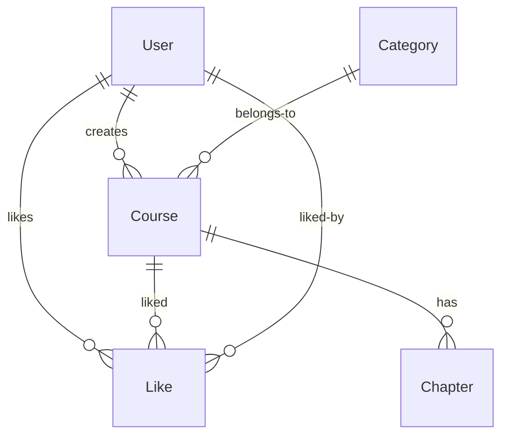

# CLWY API

基于 **Express + Sequelize + MySQL** 的在线教育平台 RESTful API，包含前台和后台管理系统。

## 技术栈

| 层 | 技术 |
|---|------|
| 运行时 | Node.js 18+ |
| 框架 | Express 4 |
| 数据库 | MySQL 8 |
| ORM | Sequelize 6 |
| 认证 | JWT (jsonwebtoken) + bcryptjs |
| 限流 | express-rate-limit |
| 日志 | morgan |
| 校验 | Sequelize Model Validation |
| Lint | ESLint + Prettier |

## 目录结构

```
clwy-api/
├── app.js                      # Express 入口，路由挂载
├── bin/www                     # HTTP 服务器启动入口
├── config/
│   └── config.json             # Sequelize 数据库配置（多环境）
├── middlewares/
│   ├── admin-auth.js           # 管理员 Bearer Token 鉴权（验证 role=100）
│   └── user-auth.js            # 通用用户鉴权（仅验证 Token，设 req.userId）
├── models/                     # Sequelize 模型
│   ├── index.js                # 模型加载器
│   ├── article.js              # 文章模型
│   ├── category.js             # 分类模型（名称唯一校验）
│   ├── chapter.js              # 章节模型（关联课程）
│   ├── course.js               # 课程模型（关联分类/用户/章节/点赞）
│   ├── like.js                 # 点赞模型（多对多关联，复合唯一索引）
│   ├── setting.js              # 系统设置模型（单例）
│   └── user.js                 # 用户模型（bcrypt 密码加密，角色控制）
├── routes/                     # 前台路由
│   ├── index.js                # 首页数据（推荐/人气/入门课程）
│   ├── categories.js           # 分类列表
│   ├── courses.js              # 课程列表（分页+分类筛选）、课程详情
│   ├── chapters.js             # 章节详情（含课程+讲师+同课程章节列表）
│   ├── articles.js             # 文章列表（分页）、文章详情
│   ├── search.js               # 课程搜索（名称模糊匹配）
│   ├── settings.js             # 系统信息
│   ├── auth.js                 # 用户注册、登录（JWT 签发）
│   ├── users.js                # 用户中心（信息查询/更新、密码修改）
│   └── likes.js                # 点赞/取消赞、点赞课程列表
├── routes/admin/               # 后台管理路由
│   ├── auth.js                 # 管理员登录（限流 10 次/15 分钟 + JWT）
│   ├── articles.js             # 文章 CRUD
│   ├── categories.js           # 分类 CRUD（含删除保护）
│   ├── chapters.js             # 章节 CRUD（含课程关联）
│   ├── charts.js               # 统计图表（性别分布、月度用户注册）
│   ├── courses.js              # 课程 CRUD（多条件筛选 + 删除保护）
│   ├── settings.js             # 系统设置 CRUD（单例）
│   └── users.js                # 用户 CRUD（排除 password 字段）
├── utils/
│   ├── errors.js               # BadRequestError / UnauthorizedError / NotFoundError
│   ├── pagination.js           # 分页参数计算工具
│   └── responses.js            # success / failure 统一响应封装
├── migrations/                 # Sequelize 数据库迁移
├── seeders/                    # 种子数据
├── .env.example                # 环境变量模板
├── eslint.config.js            # ESLint 配置
└── package.json
```

## 快速开始

### 前置要求

- Node.js >= 18
- MySQL >= 8
- npm

### 安装

```bash
# 1. 克隆项目
git clone <repo-url>
cd clwy-api

# 2. 安装依赖
npm install

# 3. 配置环境变量
cp .env.example .env
# 编辑 .env，配置端口、JWT 密钥和数据库连接信息
# SECRET_KEY 生成：node -e "console.log(require('crypto').randomBytes(32).toString('hex'))"

# 4. 修改数据库配置 config/config.json，填入实际的数据库连接信息

# 5. 创建数据库
npx sequelize-cli db:create

# 6. 运行迁移（建表）
npx sequelize-cli db:migrate

# 7. （可选）填充种子数据
npx sequelize-cli db:seed:all

# 8. 启动开发服务器
npm start
```

### 启动

```bash
npm start
# 默认监听 http://localhost:3000
# 健康检查：GET http://localhost:3000/
```

## API 文档

### 认证方式

**前台用户接口**（`/users/*`、`/likes/*`）需在请求头中携带 Bearer Token：

```
Authorization: Bearer <token>
```

Token 通过 `POST /auth/sign_in` 获取。

**管理员接口**（`/admin/*`）同样使用 Bearer Token，需管理员角色（role=100）：

```
Authorization: Bearer <token>
```

Token 通过 `POST /admin/auth/sign_in` 获取。

### 前台公开路由

| 方法 | 路径 | 描述 |
|------|------|------|
| GET | `/` | 首页（推荐课程、人气课程、入门课程） |
| GET | `/categories` | 分类列表（按 rank 排序） |
| GET | `/courses` | 课程列表（必填 categoryId，分页） |
| GET | `/courses/:id` | 课程详情（关联分类、章节、讲师） |
| GET | `/chapters/:id` | 章节详情（关联课程+讲师+同课程章节） |
| GET | `/articles` | 文章列表（分页） |
| GET | `/articles/:id` | 文章详情 |
| GET | `/settings` | 系统信息（站点名称等） |
| GET | `/search?name=` | 搜索课程（名称模糊匹配，分页） |
| POST | `/auth/sign_up` | 用户注册 |
| POST | `/auth/sign_in` | 用户登录（限流 20 次/15 分钟） |

### 前台需认证路由

| 方法 | 路径 | 描述 |
|------|------|------|
| GET | `/users/me` | 当前用户信息 |
| PUT | `/users/info` | 更新用户资料（昵称/性别/公司/简介/头像） |
| PUT | `/users/account` | 更新账户信息（邮箱/用户名/密码） |
| POST | `/likes` | 点赞/取消赞（自动切换） |
| GET | `/likes` | 用户点赞的课程列表（分页） |

#### 用户注册

```
POST /auth/sign_up
```

请求体：

```json
{
  "email": "user@example.com",
  "username": "john",
  "password": "123456",
  "nickname": "约翰"
}
```

成功响应（201）：

```json
{
  "status": 201,
  "message": "创建用户成功",
  "data": {
    "user": { "email": "user@example.com", "username": "john", "nickname": "约翰", "gender": 0, "role": 0 }
  }
}
```

**注意**：密码在 Model 层自动加密存储（bcryptjs），注册响应中已排除 `password` 字段。

#### 用户登录

```
POST /auth/sign_in
```

请求体：

```json
{
  "login": "user@example.com",
  "password": "123456"
}
```

`login` 支持邮箱或用户名两种方式。限流：同一 IP 每 15 分钟最多 20 次。

成功响应：

```json
{
  "status": 200,
  "message": "登陆成功。",
  "data": {
    "token": "eyJhbGciOiJIUzI1NiIs..."
  }
}
```

#### 更新账户信息

```
PUT /users/account
```

请求体：

```json
{
  "email": "new@example.com",
  "username": "newuser",
  "currentPassword": "old123456",
  "password": "new123456",
  "passwordConfirmation": "new123456"
}
```

需要验证当前密码才能修改。密码不一致或当前密码错误时返回 400。

### 管理员认证

| 方法 | 路径 | 描述 | 限流 |
|------|------|------|------|
| POST | `/admin/auth/sign_in` | 管理员登录 | 15 分钟 10 次 |

请求体：

```json
{
  "login": "邮箱或用户名",
  "password": "密码"
}
```

成功响应：

```json
{
  "status": 200,
  "message": "登录成功。",
  "data": {
    "token": "eyJhbGciOiJIUzI1NiIs..."
  }
}
```

### 管理员路由

所有管理员接口需携带 Bearer Token，且用户角色必须为管理员（role=100）。

#### 文章管理

| 方法 | 路径 | 描述 |
|------|------|------|
| GET | `/admin/articles` | 文章列表（支持 title 模糊搜索） |
| GET | `/admin/articles/:id` | 文章详情 |
| POST | `/admin/articles` | 创建文章 |
| PUT | `/admin/articles/:id` | 更新文章 |
| DELETE | `/admin/articles/:id` | 删除文章 |

#### 分类管理

| 方法 | 路径 | 描述 |
|------|------|------|
| GET | `/admin/categories` | 分类列表（支持 name 模糊搜索） |
| GET | `/admin/categories/:id` | 分类详情 |
| POST | `/admin/categories` | 创建分类 |
| PUT | `/admin/categories/:id` | 更新分类 |
| DELETE | `/admin/categories/:id` | 删除分类（有课程关联时禁止） |

#### 课程管理

| 方法 | 路径 | 描述 |
|------|------|------|
| GET | `/admin/courses` | 课程列表（支持 categoryId/userId/name/recommended/introductory 筛选） |
| GET | `/admin/courses/:id` | 课程详情（含分类和用户关联） |
| POST | `/admin/courses` | 创建课程 |
| PUT | `/admin/courses/:id` | 更新课程 |
| DELETE | `/admin/courses/:id` | 删除课程（有章节关联时禁止） |

#### 章节管理

| 方法 | 路径 | 描述 |
|------|------|------|
| GET | `/admin/chapters` | 章节列表（必填 courseId，支持 title 模糊搜索） |
| GET | `/admin/chapters/:id` | 章节详情（含课程关联） |
| POST | `/admin/chapters` | 创建章节 |
| PUT | `/admin/chapters/:id` | 更新章节 |
| DELETE | `/admin/chapters/:id` | 删除章节 |

#### 用户管理（管理员端）

| 方法 | 路径 | 描述 |
|------|------|------|
| GET | `/admin/users` | 用户列表（支持 email/username/nickname/role 筛选） |
| GET | `/admin/users/:id` | 用户详情 |
| POST | `/admin/users` | 创建用户 |
| PUT | `/admin/users/:id` | 更新用户 |
| DELETE | `/admin/users/:id` | 删除用户 |

**安全说明**：用户列表和详情接口返回的数据中已排除 `password` 字段。

#### 系统设置

| 方法 | 路径 | 描述 |
|------|------|------|
| GET | `/admin/settings` | 查询系统设置（单例） |
| PUT | `/admin/settings` | 更新系统设置 |

#### 统计图表

| 方法 | 路径 | 描述 |
|------|------|------|
| GET | `/admin/charts/gender` | 用户性别分布统计（男/女/未选择） |
| GET | `/admin/charts/user` | 每月用户注册数量 |

## 列表接口通用参数

| 参数 | 类型 | 默认值 | 最大 | 描述 |
|------|------|--------|------|------|
| `currentPage` | number | 1 | — | 当前页码 |
| `pageSize` | number | 10 | 100 | 每页条数 |

所有列表接口统一使用 `findAndCountAll`，返回分页信息：

```json
{
  "status": 200,
  "message": "查询成功。",
  "data": {
    "items": [...],
    "pagination": {
      "total": 100,
      "currentPage": 1,
      "pageSize": 10
    }
  }
}
```

## 统一响应格式

### 成功响应

```json
{
  "status": 200,
  "message": "操作成功。",
  "data": {}
}
```

创建操作返回 201：

```json
{
  "status": 201,
  "message": "创建成功。",
  "data": {}
}
```

### 错误响应

| 状态码 | 含义 |
|--------|------|
| 400 | 请求参数错误（Sequelize 校验 / BadRequest） |
| 401 | 认证失败（Token 缺失 / 无效 / 过期 / 无权限） |
| 404 | 资源不存在 |
| 429 | 请求过于频繁（限流触发） |
| 500 | 服务器内部错误（开发环境下返回 error.message） |

```json
{
  "status": 400,
  "message": "请求参数错误。",
  "errors": ["邮箱必须填写。"]
}
```

## 数据模型



### 枚举值

**用户角色**

| 值 | 角色 |
|----|------|
| 0 | 普通用户 |
| 100 | 管理员 |

**用户性别**

| 值 | 性别 |
|----|------|
| 0 | 未选择 |
| 1 | 男性 |
| 2 | 女性 |

### 数据库索引

| 表 | 索引 | 类型 |
|----|------|------|
| `Courses` | `categoryId` | 普通索引 |
| `Courses` | `userId` | 普通索引 |
| `Users` | `email` | 唯一索引 |
| `Users` | `username` | 唯一索引 |
| `Users` | `role` | 普通索引 |
| `Likes` | `(courseId, userId)` | 复合唯一索引 |

## 安全特性

- [x] **双认证体系** — 用户认证 (`user-auth`) 和 管理员认证 (`admin-auth`) 分离
- [x] **JWT 身份认证** — Bearer Token 标准格式，过期时间通过环境变量配置
- [x] **密码加密存储** — bcryptjs 加盐哈希，查询结果自动排除 password 字段
- [x] **登录限流** — 前台 `/auth` 15 分钟 20 次，后台 `/admin/auth` 15 分钟 10 次
- [x] **白名单输入过滤** — 所有写操作经 `filterBody` 过滤字段
- [x] **Sequelize 参数化查询** — 防止 SQL 注入
- [x] **引用完整性** — 外键关联校验，含删除保护（有子记录时禁止删除）
- [x] **复合唯一索引** — Like 表 `(courseId, userId)` 防重复点赞
- [x] **统一错误处理** — 不泄漏敏感信息
- [x] **分页参数上限** — `pageSize` 最大 100

## 环境变量

| 变量名 | 必填 | 默认值 | 描述 |
|--------|------|--------|------|
| `SECRET_KEY` | 是 | — | JWT 签名密钥（32 字节 hex） |
| `JWT_EXPIRES_IN` | 否 | `1h` | JWT Token 过期时间 |
| `PORT` | 否 | `3000` | 服务器端口 |
| `NODE_ENV` | 否 | `development` | 运行环境：development / production / test |
| `DATABASE_URL` | 否 | — | 数据库连接 URL（需 config.json 开启 use_env_variable） |
| `DB_PASSWORD` | 否 | config.json 中的值 | 数据库密码（优先级高于 config.json） |

## 脚本命令

| 命令 | 描述 |
|------|------|
| `npm start` | 启动开发服务器（nodemon 热重载） |
| `npm run lint` | ESLint 检查 |
| `npm run lint:fix` | ESLint 自动修复 |
| `npm run format` | Prettier 格式化 |
| `npm run format:check` | Prettier 格式检查 |
